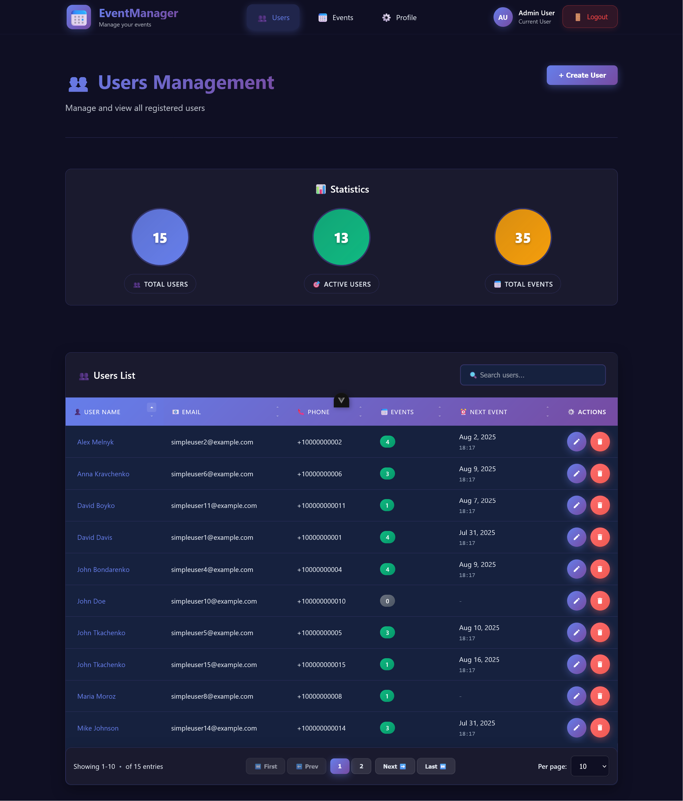
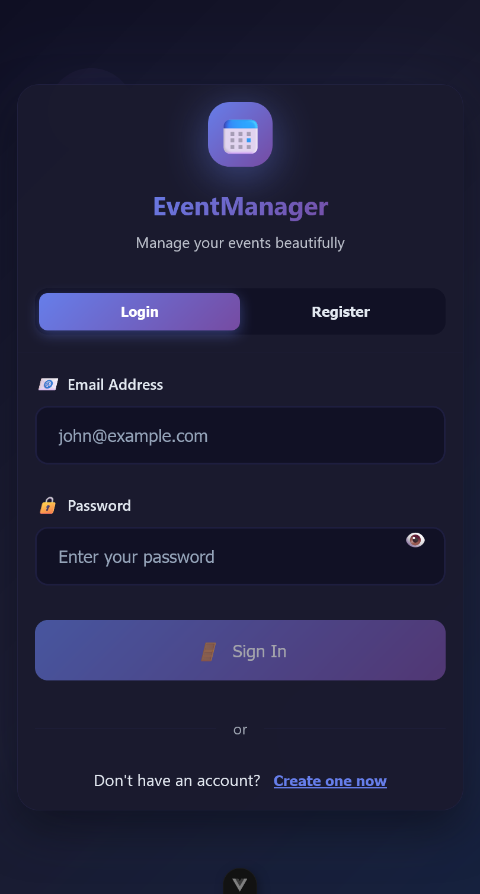
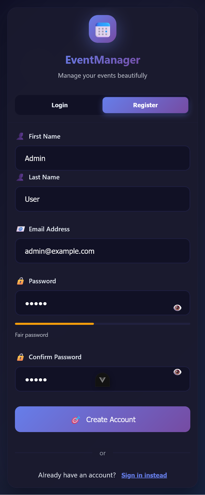
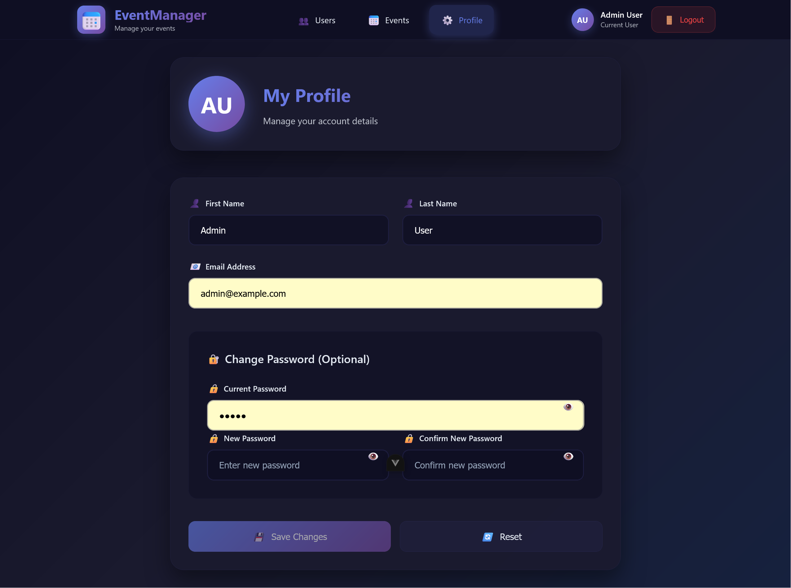
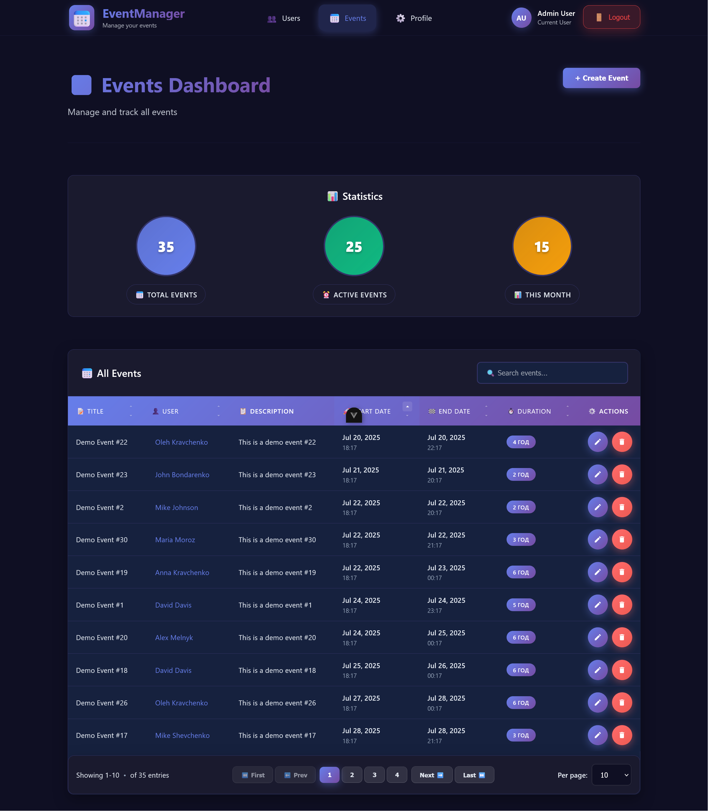
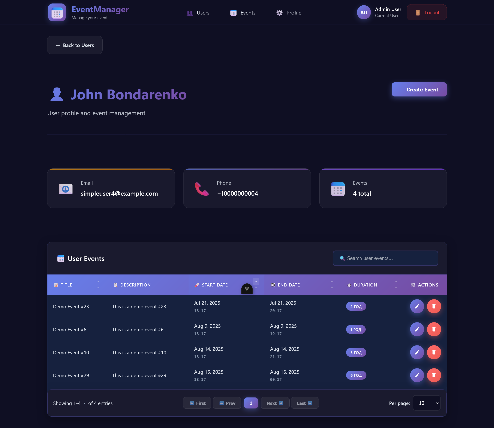

> **Test task for ThinkMobiles**

# Users & Events CRUD Application

A modern full-stack CRUD application for managing users and events, built with Node.js/Express (backend) and Vue.js 3 (frontend).
Features beautiful UI design, smooth animations, unique and stylish modal windows, responsive layout, and a fully functional mobile version for a modern user experience.

## 🖼️ Preview & Demo Video


<p align="center">
  
</p>

<p align="center">
  
  
</p>
<p align="center">
  
</p>
<p align="center">
  
</p>
<p align="center">
  
</p>

**Demo video:**

<p align="center">
  <video src="assets/demo.mkv" controls width="700" poster="assets/preview.png">
    Your browser does not support the video tag.
  </video>
</p>

> _The video is located in `assets/demo.mkv`. If Markdown/README does not display the video, open the file directly or view it in the repository._

## 🚀 Features

### 🔐 Authentication
- JWT-based authentication
- User registration and login
- Protected routes with middleware
- Session management with auto-logout

### 👥 User Management
- Create, read, update, delete users
- User profile management
- Input validation and error handling
- Search and pagination

### 📅 Event Management
- Create, read, update, delete events
- Link events to users
- Date/time management
- Event statistics and analytics

### 🎨 Modern UI/UX
- Beautiful and clean interface
- Smooth page and component animations
- Unique, stylish modal windows for forms and confirmations
- Responsive, adaptive layout (desktop & mobile)
- Fully functional mobile version
- Real-time form validation
- Loading states and error handling

## 🛠️ Tech Stack

### Backend
- **Node.js** - Runtime environment
- **Express.js** - Web framework
- **MongoDB** - Database
- **Mongoose** - ODM
- **JWT** - Authentication
- **bcryptjs** - Password hashing
- **express-validator** - Input validation

### Frontend
- **Vue.js 3** - Frontend framework
- **Composition API** - Modern Vue patterns
- **Pinia** - State management
- **Vue Router** - Client-side routing
- **Axios** - HTTP client
- **Vite** - Build tool


## 📁 Project Structure

```
users-events-crud/
│
├── server/                  # Backend (Node.js/Express)
│   ├── app.js               # Main app entry
│   ├── bin/www              # Server start script
│   ├── config/              # DB and app config
│   ├── constants/           # Shared constants
│   ├── middleware/          # Express middlewares
│   ├── models/              # Mongoose models (User, SimpleUser, Event)
│   ├── routes/              # API routes
│   ├── services/            # Business logic
│   ├── utils/               # Helpers
│   ├── seed.js              # Demo data seeder
│   └── package.json         # Backend dependencies/scripts
│
├── client/                  # Frontend (Vue 3)
│   ├── src/
│   │   ├── assets/          # Static assets (css, svg)
│   │   ├── components/      # Vue components
│   │   ├── composables/     # Vue composables
│   │   ├── config/          # Frontend config
│   │   ├── constants/       # Frontend constants
│   │   ├── router/          # Vue Router config
│   │   ├── services/        # API services
│   │   ├── stores/          # Pinia stores
│   │   ├── utils/           # Helpers
│   │   └── views/           # Page views
│   ├── public/              # Static public files
│   ├── package.json         # Frontend dependencies/scripts
│   └── vite.config.js       # Vite config
│
└── README.md                # Project documentation
```

## 🚀 Demo Configuration

The project includes a ready-to-use demo configuration for quick start and testing:

- 1 admin user:
  - **Email:** admin@example.com
  - **Password:** admin
- 15 demo SimpleUsers (owned by admin)
- 35 random Events (assigned to SimpleUsers)

To generate demo data, use the seed script (see below).

---

## 🚀 Getting Started

### Prerequisites
- Node.js (v16 or higher)
- MongoDB (running locally or connection string)

### Installation

1. **Clone the repository**
   ```bash
   git clone <repository-url>
   cd users-events-crud
   ```

2. **Install server dependencies**
   ```bash
   cd server
   npm install
   ```

3. **Install client dependencies**
   ```bash
   cd ../client
   npm install
   ```

4. **Environment Configuration**
   
   Create `.env` file in the server directory:
   ```env
   NODE_ENV=development
   PORT=5000
   MONGODB_URI=mongodb://localhost:27017/users-events-db
   JWT_SECRET=your-super-secret-key
   JWT_EXPIRE=30d
   ```


5. **Seed the database with demo data**
   ```bash
   cd server
   node seed.js
   ```
   > After this step, you can log in as admin@example.com / admin and see demo users and events in the UI.

### Running the Application

#### Development Mode
Start both server and client in development mode:
```bash
# From project root - uses VS Code task
npm run dev
```

Or start them separately:

**Backend:**
```bash
cd server
npm start
```

**Frontend:**
```bash
cd client
npm run dev
```

#### Production Mode
```bash
# Build client
cd client
npm run build

# Start server
cd ../server
npm start
```

## 📋 Available Scripts

### Server
- `npm start` - Start the server
- `npm run dev` - Start with nodemon
- `node seed.js` - Seed database with sample data

### Client
- `npm run dev` - Start development server
- `npm run build` - Build for production
- `npm run preview` - Preview production build

## 🔧 API Documentation

### Authentication Endpoints
- `POST /api/auth/register` - Register new user
- `POST /api/auth/login` - Login user
- `GET /api/auth/me` - Get current user
- `POST /api/auth/logout` - Logout user

### User Endpoints
- `GET /api/users` - Get all users
- `POST /api/users` - Create new user
- `GET /api/users/:id` - Get user by ID
- `PUT /api/users/:id` - Update user
- `DELETE /api/users/:id` - Delete user

### Event Endpoints
- `GET /api/events` - Get all events
- `POST /api/events` - Create new event
- `GET /api/events/:id` - Get event by ID
- `PUT /api/events/:id` - Update event
- `DELETE /api/events/:id` - Delete event

## 🏗️ Architecture Patterns

### Backend Architecture
- **Service Layer Pattern** - Business logic separation
- **Repository Pattern** - Data access abstraction
- **Middleware Pattern** - Request/response processing
- **Error Handling** - Centralized error management

### Frontend Architecture
- **Composables Pattern** - Reusable logic extraction
- **Store Pattern** - Centralized state management
- **Component Composition** - Modular UI components
- **Route Guards** - Navigation protection

## 🔒 Security Features

- **JWT Authentication** with secure token handling
- **Password Hashing** using bcryptjs
- **Input Validation** on both client and server
- **CORS Protection** with configured origins
- **Route Protection** with authentication middleware

## 🚀 Deployment

### Environment Variables
Ensure these are set in production:
- `NODE_ENV=production`
- `MONGODB_URI` - Your MongoDB connection string
- `JWT_SECRET` - Strong secret key
- `PORT` - Server port (default: 5000)

## 🤝 Contributing

1. Fork the repository
2. Create a feature branch
3. Make your changes
4. Add tests if applicable
5. Submit a pull request

## 📝 License

This project is licensed under the MIT License.

---

**Built with ❤️ using modern web technologies**
